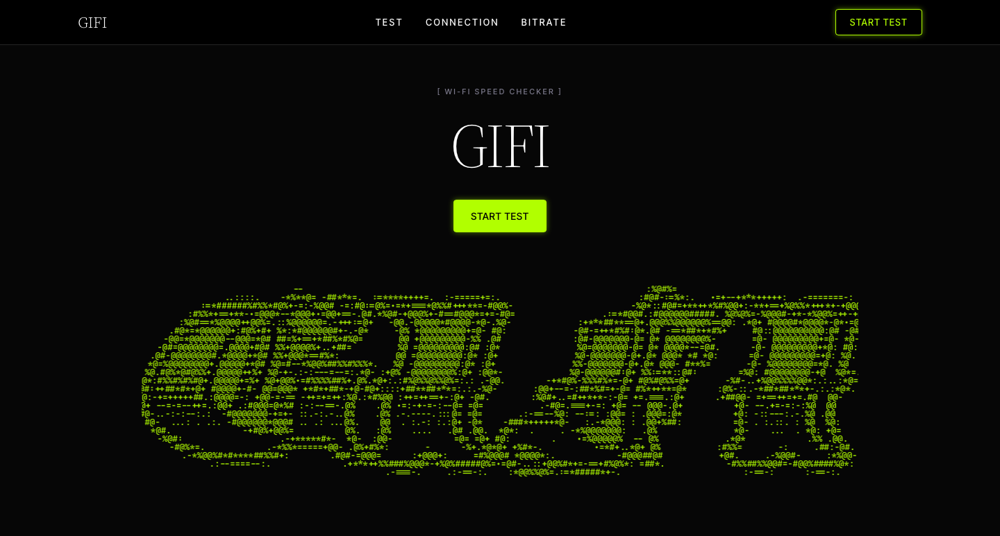
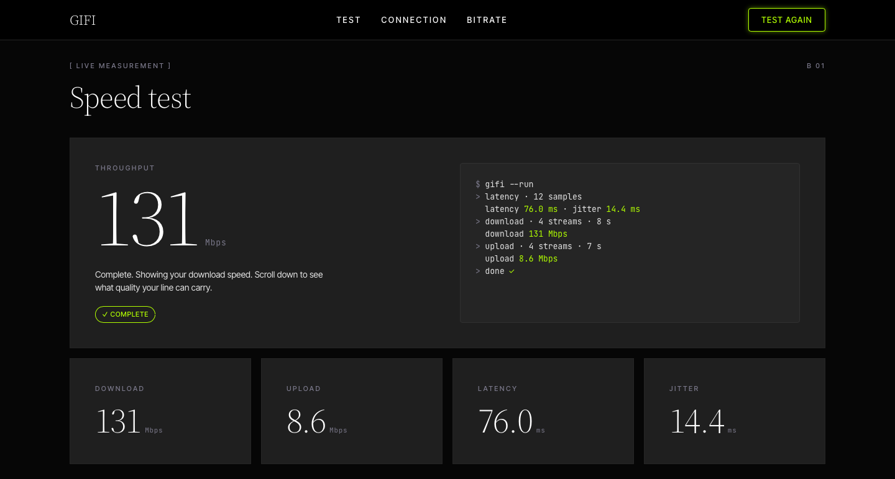

# GIFI

A Wi-Fi speed checker that runs in a single HTML file. Measure your download, upload, latency and jitter, see your IP and provider, and check what video quality your connection can handle.

## Features

- **Speed test**: download, upload, latency and jitter, with a live readout and a test log
- **Connection details**: public IP address, provider (ISP and ASN), location and test server
- **Bitrate**: your speed in Mbps, kbps and MB/s, plus a grade for watching (480p to 4K) and live streaming (480p to 4K)
- **Bitrate checker**: type any bitrate and see if your download and upload can carry it
- **ASCII art hero** with a subtle wave and glitch animation
- No dependencies, no build step, no backend

## Usage

1. Download `gifi.html`.
2. Open it in any modern browser with an internet connection.
3. Press **Start test**.

To host it on GitHub Pages, rename `gifi.html` to `index.html`, push it to your repo, and turn on Pages in the repo settings.

## How it works

| Measurement | Method |
|-------------|--------|
| Latency and jitter | 12 small requests to Cloudflare's speed server. The first is discarded, latency is the median, and jitter is the average difference between samples |
| Download | 4 parallel streams for 8 seconds. The first second is ignored as warm-up |
| Upload | 4 parallel uploads of random data for 7 seconds, with the same warm-up |
| IP and provider | Cloudflare's `/meta` endpoint, with `ipwho.is` as a fallback |

Bitrate grades compare your speed to typical bitrates for each quality:

- **Smooth**: your speed is at least 1.5× the bitrate
- **Marginal**: your speed meets the bitrate but with little headroom
- **Too slow**: your speed is below the bitrate

## Notes

- Results show the path between your device and Cloudflare's nearest server, not your provider's advertised speed.
- For the most accurate reading, close other downloads and use one device.
- Location is estimated from your IP and can be off by a city or two. On a VPN, you will see the VPN's details.
- Ad or privacy blockers may block the test requests.

## Tech

HTML, CSS and vanilla JavaScript. Fonts: Source Serif 4, Inter Tight and JetBrains Mono from Google Fonts.

## Made by

[Gajee Hub](https://gajeee.github.io/Portfolio/) · [GitHub](https://github.com/Gajeee) · [LinkedIn](https://www.linkedin.com/in/gajenes-asitambi-411049347)
